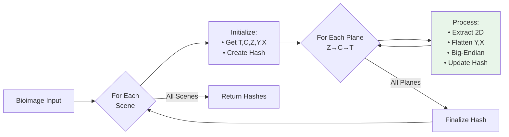

# IMAGEWALK

*Deterministic Traversal of Multi-Dimensional Bioimage Pixel Data*

**Deterministic algorithm for traversing and canonicalizing pixel data from multi-dimensional bioimages to
produce consistent, reproducible hash digests across platforms and file formats.**

## Abstract

This specification defines a deterministic algorithm for traversing multi-dimensional bioimage data and
converting it to canonical byte sequences. The algorithm ensures that identical pixel data produces identical
hash outputs regardless of source format (OME-TIFF, OME-Zarr, OMERO, CZI, etc.) or storage platform. It handles
common bioimage dimensions (T, C, Z, Y, X), supports multi-scene files, and provides a format-agnostic
foundation for content-based identification of bioimaging data.

## Status

This specification is DRAFT as of 2025-10-03.

## 1. Introduction

### 1.1 Motivation

Bioimaging data exists in numerous formats with different internal storage layouts and dimension orders.
Traditional format-specific hashing produces different results for semantically identical pixel data stored in
different formats. This specification solves that problem by defining a canonical traversal and byte
representation that is independent of storage format, enabling reproducible content-based identifiers for
bioimage data.

### 1.2 Scope

This specification defines:

**IMAGEWALK Algorithm**:

- Deterministic plane traversal order for multi-dimensional bioimage data
- Canonical byte representation for 2D pixel planes
- Handling of standard bioimage dimensions (T, C, Z, Y, X)
- Processing of multi-scene/multi-series files

It does NOT cover:

- File format parsing, decoding, or storage APIs
- Hash algorithm selection or implementation details
- Pixel value transformations, rescaling, or normalization
- Metadata extraction, validation, or processing
- Image compression or encoding methods

### 1.3 Notation and Conventions

The key words "MUST", "MUST NOT", "REQUIRED", "SHALL", "SHALL NOT", "SHOULD", "SHOULD NOT", "RECOMMENDED",
"MAY", and "OPTIONAL" in this document are interpreted as described in [RFC 2119] and [RFC 8174].

## 2. Terminology

**Bioimage** : Multi-dimensional pixel array representing microscopy or other bioimaging data.

**Plane** : A 2D array of pixels with dimensions Y (height) and X (width) at a specific combination of Z
(depth), C (channel), and T (time) coordinates. Each plane contains pixel intensity values for a single channel
at a single focal depth and timepoint.

**Dimension** : An axis of the multi-dimensional array. Standard bioimage dimensions are:

- **T** (Time): Temporal dimension for time-series data
- **C** (Channel): Spectral or fluorescence channel dimension representing a specific imaging modality (e.g.,
    GFP, DAPI, brightfield). A channel consists of all planes sharing the same C index across different Z and T
    coordinates
- **Z** (Depth): Z-stack or focal plane dimension
- **Y** (Height): Vertical spatial dimension
- **X** (Width): Horizontal spatial dimension

**Scene/Series** : Independent image within a multi-image file. Each scene/series has its own dimensional
structure and is processed independently.

**Canonical Bytes** : Standardized byte representation of pixel data ensuring deterministic, cross-platform
reproducible output.

**Row-Major Order** : Linear ordering where rightmost indices vary fastest (C-order). For 2D plane (Y, X),
pixels are ordered: row 0 (all X), row 1 (all X), etc.

**Big-Endian** : Byte order where the most significant byte is stored at the lowest memory address (network byte
order).

## 3. Algorithm Overview



The algorithm processes bioimages deterministically by:

1. Processing each scene/series independently
2. Traversing planes in Z->C->T order
3. Converting each plane to canonical bytes
4. Producing one hash per scene/series

## 4. Core Algorithm Specification

### 4.1 Multi-Scene Processing

For files containing multiple scenes/series, implementations **MUST**:

1. **Process each scene/series independently** - Initialize a new hash processor for each scene
2. **Maintain scene order** - Process scenes in ascending numerical order (0, 1, 2, ...)
3. **Generate separate hashes** - Produce one hash output per scene/series
4. **Return ordered list** - Return hashes as a list in scene/series order

!!! note

    Single-scene files produce a single-element list. Empty files or files with no accessible scenes return an empty
    list.

### 4.2 Dimension Identification

For each scene/series, implementations **MUST**:

1. **Identify present dimensions** - Determine which dimensions (T, C, Z, Y, X) exist in the data
2. **Determine dimension sizes** - Get the size of each dimension
3. **Map dimension positions** - Identify where each dimension appears in the data structure

The Y and X dimensions **MUST** be present in all bioimages. The T, C, and Z dimensions are **OPTIONAL**.

When a dimension is absent:

- Treat its size as 1
- Skip the corresponding loop in traversal
- Do not include it in dimension ordering

### 4.3 Plane Traversal Order

!!! tip "Quick Reference"

    Traverse planes in Z→C→T order: outermost Z, middle C, innermost T Each plane is a 2D pixel array for one
    channel at one Z-position and timepoint

Implementations **MUST** traverse planes using nested loops in this exact order:

1. **Outermost loop: Z dimension** - Iterate from 0 to size_z - 1
2. **Middle loop: C dimension** - Iterate from 0 to size_c - 1
3. **Innermost loop: T dimension** - Iterate from 0 to size_t - 1

For each combination of coordinates (z, c, t), extract the 2D plane at position (z, c, t, :, :). This plane
contains pixel intensity values for channel c at z-position z and timepoint t.

#### Example Traversal

For an image with size_z=2, size_c=3, size_t=2, planes are processed in this order:

```
Plane 1:  z=0, c=0, t=0
Plane 2:  z=0, c=0, t=1
Plane 3:  z=0, c=1, t=0
Plane 4:  z=0, c=1, t=1
Plane 5:  z=0, c=2, t=0
Plane 6:  z=0, c=2, t=1
Plane 7:  z=1, c=0, t=0
Plane 8:  z=1, c=0, t=1
Plane 9:  z=1, c=1, t=0
Plane 10: z=1, c=1, t=1
Plane 11: z=1, c=2, t=0
Plane 12: z=1, c=2, t=1
```

Total planes: 2 × 3 × 2 = 12

!!! warning

    The traversal order is Z→C→T, not the dimension storage order. This order is independent of how the source
    format stores pixel data internally.

### 4.4 Canonical Byte Conversion

!!! tip "Quick Reference"

    Flatten 2D plane in row-major order (Y then X) and encode as big-endian bytes

For each extracted 2D plane, implementations **MUST** apply the following conversion:

#### Step 1: Validate Plane Dimensionality

The plane **MUST** have exactly 2 dimensions (Y, X). If the extracted plane has singleton dimensions, they
**MUST** be squeezed out before conversion.

#### Step 2: Flatten in Row-Major Order

Flatten the 2D array using row-major (C-order) traversal:

- Y dimension varies slowest (outer loop)
- X dimension varies fastest (inner loop)
- Linearization order: (0,0), (0,1), ..., (0,X-1), (1,0), (1,1), ..., (Y-1,X-1)

This produces a 1D array of size Y × X.

#### Step 3: Encode as Big-Endian Bytes

Convert pixel values to big-endian byte sequences:

- For single-byte types (int8, uint8): Each pixel becomes 1 byte
- For multi-byte types (int16, uint16, int32, uint32, float32, float64):
    - Each pixel is encoded in big-endian byte order
    - Most significant byte appears first in the byte sequence

**Rationale**: Big-endian encoding ensures cross-platform reproducibility regardless of host system byte order.

#### Example: 2×2 uint16 Plane

```yaml
Input plane (row-major notation):
  [[256, 512],
   [768, 1024]]

After flattening: [256, 512, 768, 1024]

Canonical bytes (big-endian uint16):
  0x01 0x00  0x02 0x00  0x03 0x00  0x04 0x00

Total: 8 bytes (4 pixels × 2 bytes per pixel)
```

#### Understanding Planes in Multi-Channel Images

For a 3-channel RGB image with dimensions C=3, Y=512, X=512:

- Plane at (z=0, c=0, t=0): 512×512 2D array of RED channel intensities
- Plane at (z=0, c=1, t=0): 512×512 2D array of GREEN channel intensities
- Plane at (z=0, c=2, t=0): 512×512 2D array of BLUE channel intensities

Each plane is processed separately to create its canonical byte sequence.

### 4.5 Hash Processing

Implementations **MUST** follow this hash processing protocol:

1. **Initialize processor** - Create a new hash processor instance at the start of each scene/series
2. **Incremental updates** - Feed canonical bytes from each plane to the hash processor in traversal order
3. **Finalize hash** - After all planes are processed, finalize and extract the hash for that scene/series
4. **Collect results** - Append the scene hash to the output list

!!! note

    This specification does not mandate a specific hash algorithm. The canonical byte sequence produced by IMAGEWALK
    can be used with any hash function or content identification scheme. Reference implementations use ISCC-SUM
    (iscc_sum.IsccSumProcessor) for bioimage fingerprinting.

## 5. Implementation Examples

### 5.1 Simple 2D Grayscale Image

```yaml
Structure:
  Dimensions: Y=512, X=512
  Data type: uint8
  Scenes: 1

Processing:
  - Dimension sizes: size_z=1, size_c=1, size_t=1
  - Total planes: 1 × 1 × 1 = 1
  - Single plane at (0, 0, 0, :, :)
  - Flatten: 512 × 512 = 262,144 pixels
  - Convert: 262,144 bytes (uint8 is single byte)
  - Feed to hash processor
  - Finalize hash

Output:
  - Single hash string
```

### 5.2 Multi-Channel RGB Time Series

```yaml
Structure:
  Dimensions: T=10, C=3, Y=256, X=256
  Data type: uint16
  Scenes: 1

Processing:
  - Dimension sizes: size_z=1, size_c=3, size_t=10
  - Total planes: 1 × 3 × 10 = 30
  - Traversal order: z=0, c=0–2, t=0–9
  - Each plane: 256 × 256 = 65,536 pixels
  - Each plane: 131,072 bytes (65,536 × 2 bytes)
  - Feed 30 planes to hash processor
  - Finalize hash

Output:
  - Single hash string
```

### 5.3 Multi-Scene Confocal Z-Stack

```yaml
Structure:
  Dimensions (per scene): Z=20, C=2, Y=1024, X=1024
  Data type: uint16
  Scenes: 3

Processing (per scene):
  - Dimension sizes: size_z=20, size_c=2, size_t=1
  - Total planes: 20 × 2 × 1 = 40
  - Traversal order: z=0–19, c=0–1, t=0
  - Each plane: 1024 × 1024 = 1,048,576 pixels
  - Each plane: 2,097,152 bytes (1,048,576 × 2 bytes)
  - Feed 40 planes to hash processor
  - Finalize hash
  - Repeat for scenes 1 and 2

Output:
  - List of 3 hash strings
```

## 6. Implementation Guidance

### 6.1 Memory Efficiency

Implementations **SHOULD**:

- Process planes one at a time without loading entire datasets into memory
- Use streaming/incremental hash processors that accept data in chunks
- Leverage lazy evaluation and delayed loading when available
- Consider resolution pyramids for large images (use appropriate resolution level)

!!! tip

    Many bioimage formats support chunked/tiled storage. Implementations can read plane data tile-by-tile and feed
    bytes incrementally to the hash processor.

### 6.2 Data Type Support

Implementations **MUST** support the following pixel data types:

- **Unsigned integers**: uint8, uint16, uint32
- **Signed integers**: int8, int16, int32
- **Floating point**: float32 (single precision), float64 (double precision)

Implementations **MAY** support additional types (e.g., uint64, int64, complex64, complex128) but **MUST**
document their byte encoding conventions.

### 6.3 Performance Optimization

Implementations **MAY**:

- Use vectorized operations for byte-order conversion
- Utilize native library functions (e.g., NumPy's `tobytes()` with dtype specification)
- Parallelize processing of independent scenes/series
- Cache dimension metadata to avoid repeated queries

!!! warning

    When parallelizing scene processing, ensure the output hash list maintains scene order. Hashes must be assembled
    in ascending scene index order (0, 1, 2, ...).

### 6.4 Error Handling

Implementations **MUST**:

- Validate that extracted planes are 2D before canonicalization
- Provide clear error messages for unsupported data types
- Handle missing or inaccessible scenes gracefully (skip and log warning)
- Detect and report dimension mismatches or malformed data

Implementations **SHOULD**:

- Validate dimension sizes are positive integers
- Check for reasonable dimension sizes to prevent resource exhaustion
- Warn when processing extremely large images that may cause memory issues

## 7. Test Vectors

Implementations **MUST** produce correct outputs for these test cases:

### 7.1 Canonical Byte Conversion Tests

#### Test Case 1: Tiny uint8 Plane

**Input:**

```yaml
Dimensions: Y=2, X=2
Data type: uint8
Values (row-major): [[1, 2], [3, 4]]
```

**Expected canonical bytes:**

```
0x01 0x02 0x03 0x04
```

**Explanation**: Single-byte type, flattened row-major: row 0 (1, 2), row 1 (3, 4)

#### Test Case 2: Tiny uint16 Plane

**Input:**

```yaml
Dimensions: Y=2, X=2
Data type: uint16
Values (row-major): [[256, 512], [768, 1024]]
```

**Expected canonical bytes:**

```
0x01 0x00  0x02 0x00  0x03 0x00  0x04 0x00
```

**Explanation**: Big-endian encoding. 256 = 0x0100 → 0x01 0x00 (MSB first)

#### Test Case 3: Float32 Plane

**Input:**

```yaml
Dimensions: Y=1, X=2
Data type: float32
Values: [[1.0, 2.0]]
```

**Expected canonical bytes:**

```
0x3F 0x80 0x00 0x00  0x40 0x00 0x00 0x00
```

**Explanation**: IEEE 754 single precision, big-endian. 1.0 = 0x3F800000, 2.0 = 0x40000000

### 7.2 Traversal Order Tests

#### Test Case 4: Multi-Dimensional Traversal

**Input:**

```yaml
Dimensions: T=2, C=2, Z=2, Y=1, X=1
Data type: uint8
Values: Single pixel per plane, all pixels have value 0xFF
```

**Expected plane extraction order:**

```
1. z=0, c=0, t=0
2. z=0, c=0, t=1
3. z=0, c=1, t=0
4. z=0, c=1, t=1
5. z=1, c=0, t=0
6. z=1, c=0, t=1
7. z=1, c=1, t=0
8. z=1, c=1, t=1
```

**Expected canonical bytes:**

```
0xFF 0xFF 0xFF 0xFF 0xFF 0xFF 0xFF 0xFF
```

**Total bytes**: 8 (one per plane)

### 7.3 Multi-Scene Tests

#### Test Case 5: Two-Scene File

**Input:**

```yaml
Scene 0:
  Dimensions: Y=1, X=1
  Data type: uint8
  Value: 0x01

Scene 1:
  Dimensions: Y=1, X=1
  Data type: uint8
  Value: 0x02
```

**Expected output:**

```yaml
- Hash from canonical bytes 0x01
- Hash from canonical bytes 0x02
```

**Constraint**: Output must be a list of exactly 2 hashes in scene order

## 8. Conformance

An implementation conforms to this specification if it satisfies all of the following:

1. **Deterministic output**: Produces identical hash sequences for identical pixel data across different source
    formats and platforms

2. **Scene ordering**: Processes scenes/series in ascending numerical order (0, 1, 2, ...) and returns hashes in
    the same order

3. **Plane traversal**: Iterates planes in Z→C→T order (outermost to innermost)

4. **Row-major flattening**: Flattens 2D planes in row-major order (Y varies slowly, X varies fast)

5. **Big-endian encoding**: Encodes multi-byte pixel values in big-endian byte order

6. **Data type support**: Correctly handles all required data types (uint8, uint16, uint32, int8, int16, int32,
    float32, float64)

7. **Test vectors**: Produces correct canonical byte sequences for all test vectors in Section 7

## 9. Extensibility

### 9.1 Custom Hash Algorithms

This specification defines the canonical byte sequence generation but does not mandate a specific hash
algorithm. Implementations **MAY** use:

- Cryptographic hashes (SHA-256, BLAKE3)
- Perceptual hashes (pHash, ISCC)
- Content-defined chunking hashes (FastCDC + SHA)
- Rolling hashes for incremental processing

The canonical byte sequence ensures reproducibility regardless of hash algorithm choice.

### 9.2 Additional Dimensions

Future extensions **MAY** define handling for additional dimensions beyond T, C, Z, Y, X. If extended:

- The specification **MUST** define the position of new dimensions in traversal order
- The specification **MUST** maintain deterministic, reproducible ordering
- Backward compatibility **SHOULD** be preserved for standard 5D data

### 9.3 Metadata Integration

Implementations **MAY** incorporate metadata (pixel size, channel names, acquisition parameters) into hash
generation. If metadata is included:

- The specification **MUST** define canonical metadata ordering and encoding
- Metadata processing **MUST** be deterministic and format-agnostic
- Pixel data and metadata hashing **SHOULD** be clearly separable

## 10. References

### Normative

- RFC 2119: Key words for use in RFCs to Indicate Requirement Levels
- RFC 8174: Ambiguity of Uppercase vs Lowercase in RFC 2119 Key Words
- IEEE 754: Standard for Floating-Point Arithmetic

### Informative

- OME-NGFF Specification (OME-Zarr format)
- OMERO Data Model Documentation
- ISO 24138:2024 - International Standard Content Code
- BioFormats Supported Formats Documentation
