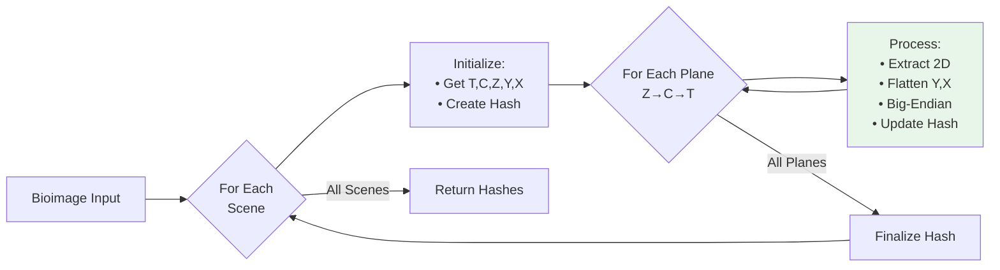

# IMAGEWALK

*Deterministic Traversal of Multi-Dimensional Bioimage Pixel Data*

!!! important "Canonical Specification: IEP-0018"

    The IMAGEWALK specification has been contributed to the ISCC Enhancement Proposal process and is now maintained
    as **[IEP-0018](https://ieps.iscc.codes/iep-0018/)**. IEP-0018 is the canonical, normative version of the
    specification. This page is a non-normative overview for `iscc-bio` users and developers.

## Overview

IMAGEWALK defines a deterministic algorithm for traversing multi-dimensional bioimage data and converting it to
canonical byte sequences. It ensures that identical pixel data produces identical hash outputs regardless of
source format (OME-TIFF, OME-Zarr, OMERO, CZI, etc.) or storage platform, providing a format-agnostic foundation
for content-based identification of bioimaging data.

```mermaid
flowchart LR
    A[Bioimage Input] --> B{For Each<br/>Scene}
    B --> C[Initialize:<br/>• Get T,C,Z,Y,X<br/>• Create Hash]

    C --> D{For Each Plane<br/>Z→C→T}
    D --> E[Process:<br/>• Extract 2D<br/>• Flatten Y,X<br/>• Big-Endian<br/>• Update Hash]

    E --> D
    D -->|All Planes| F[Finalize Hash]
    F --> B
    B -->|All Scenes| G[Return Hashes]

    style E fill:#e8f5e9
```

## Key Rules

- **Multi-scene independence**: Each scene/series is processed independently in ascending order, producing one
    hash per scene
- **Z→C→T traversal**: Planes are iterated with Z as the outermost loop, C in the middle, and T innermost
- **Canonical bytes**: Each 2D plane is flattened in row-major order (Y then X) and encoded as big-endian bytes
- **Data types**: Supports uint8/16/32, int8/16/32, float32, and float64 pixel types

For the complete normative requirements, test vectors, and conformance criteria, refer to
[IEP-0018](https://ieps.iscc.codes/iep-0018/).

## Implementation in iscc-bio

`iscc-bio` implements IMAGEWALK in the `iscc_bio.imagewalk` package with three interchangeable backends that
produce identical hashes for identical pixel data:

- **`iw_bioio.py`**: BioIO-based plane iteration for local files
- **`iw_ngff.py`**: OME-NGFF/Zarr plane iteration
- **`iw_blitz.py`**: OMERO Blitz plane iteration for remote servers

Specification conformance tests (canonical byte conversion, traversal order, data type support) live in
`tests/test_imagewalk_spec.py`.
