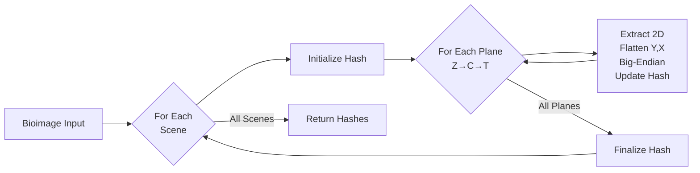

# IMAGEWALK

*Deterministic Traversal of Multi-Dimensional Bioimage Pixel Data*

## Abstract

IMAGEWALK defines a deterministic algorithm for traversing multi-dimensional bioimage data and converting it to
canonical byte sequences. It ensures identical pixel data produces identical hash outputs regardless of source
format (OME-TIFF, OME-Zarr, OMERO, CZI, etc.) or platform. The algorithm handles standard bioimage dimensions (
T, C, Z, Y, X) and multi-scene files, providing format-agnostic content identification for bioimaging data.

## Status

This specification is DRAFT as of 2025-10-06.

!!! note "OMERO Compatibility"

    This specification is based on and compatible with OMERO server v5.29.2's internal pixel data canonicalization
    method for generating hashes at the scene/image level.

## 1. Scope

This specification defines:

**IMAGEWALK Algorithm**:

- Deterministic plane traversal order for multi-dimensional bioimage data
- Canonical byte representation for 2D pixel planes
- Handling of standard bioimage dimensions (T, C, Z, Y, X)
- Processing of multi-scene/multi-series files

It does NOT cover:

- File format parsing, decoding, or storage APIs
- Hash algorithm selection or implementation
- Pixel transformations or metadata processing

## 2. Terminology

**Bioimage**: Multi-dimensional pixel array representing microscopy or bioimaging data.

**Plane**: A 2D array of pixels (Y×X) at specific Z, C, T coordinates.

**Dimensions**:

- **T** (Time): Temporal dimension
- **C** (Channel): Spectral/fluorescence channel (e.g., GFP, DAPI, brightfield)
- **Z** (Depth): Z-stack/focal plane dimension
- **Y, X**: Spatial dimensions (required)

**Scene/Series**: Independent image within a multi-image file.

**Canonical Bytes**: Standardized byte representation ensuring cross-platform reproducibility.

**Row-Major Order**: Linear ordering where X varies fastest (C-order).

**Big-Endian**: Most significant byte first (network byte order).

## 3. Algorithm Overview



## 4. Core Algorithm Specification

### 4.1 Multi-Scene Processing

For files containing multiple scenes/series:

1. Process each scene independently with a new hash processor
2. Maintain scene order (0, 1, 2, ...)
3. Return one hash per scene as an ordered list

### 4.2 Dimension Identification

For each scene:

1. Identify present dimensions (T, C, Z, Y, X)
2. Y and X are required; T, C, Z are optional
3. Absent dimensions have size 1

### 4.3 Plane Traversal Order

Traverse planes in **Z→C→T order** (outermost to innermost):

```python
for z in range(size_z):  # Outermost
    for c in range(size_c):  # Middle
        for t in range(size_t):  # Innermost
            extract_2d_plane(z, c, t,:,:)
```

Example for size_z=2, size_c=3, size_t=2:

```
z=0, c=0: t=0, t=1
z=0, c=1: t=0, t=1
z=0, c=2: t=0, t=1
z=1, c=0: t=0, t=1
... (12 total planes)
```

### 4.4 Canonical Byte Conversion

For each 2D plane:

1. **Validate**: Ensure exactly 2 dimensions (Y, X)
2. **Flatten**: Row-major order where Y varies slowest, X fastest: (0,0), (0,1), ..., (Y-1,X-1)
3. **Encode**: Big-endian byte order for all data types

**Data Types**:

- Single-byte: uint8, int8 → 1 byte per pixel
- Multi-byte: uint16, int16, uint32, int32, float32, float64 → big-endian encoding

### 4.5 Hash Processing

1. Initialize hash processor per scene
2. Feed canonical bytes from each plane in traversal order
3. Finalize hash after all planes processed
4. Append to output list

## 5. Implementation Examples

**Simple 2D Grayscale (512×512 uint8)**

- Dimensions: Z=1, C=1, T=1 → 1 plane → 262,144 bytes → single hash

**Multi-Channel RGB Time Series (256×256 uint16)**

- Dimensions: Z=1, C=3, T=10 → 30 planes × 131,072 bytes each → single hash

**Multi-Scene Confocal Z-Stack (1024×1024 uint16)**

- 3 scenes, each Z=20, C=2, T=1 → 40 planes per scene → list of 3 hashes

## 6. Implementation Guidance

### 6.1 Memory Efficiency

- Process planes individually without loading entire datasets
- Use streaming hash processors
- Leverage lazy evaluation when available

### 6.2 Data Type Support

**Required**: uint8, uint16, uint32, int8, int16, int32, float32, float64

### 6.3 Performance

- Vectorized byte-order conversion recommended
- Parallel scene processing allowed (maintain output order)
- Cache dimension metadata

### 6.4 Error Handling

**MUST**:

- Validate planes are 2D with positive dimensions
- Provide clear errors for unsupported types
- Handle missing scenes gracefully (skip with warning)
- Detect dimension mismatches

## 7. Test Vectors

### Test Case 1: uint8 Plane

```yaml
Input: Y=2, X=2, uint8, [[1, 2], [3, 4]]
Expected bytes: 0x01 0x02 0x03 0x04
```

### Test Case 2: uint16 Plane

```yaml
Input: Y=2, X=2, uint16, [[256, 512], [768, 1024]]
Expected bytes: 0x01 0x00  0x02 0x00  0x03 0x00  0x04 0x00
```

### Test Case 3: float32 Plane

```yaml
Input: Y=1, X=2, float32, [[1.0, 2.0]]
Expected bytes: 0x3F 0x80 0x00 0x00  0x40 0x00 0x00 0x00
```

### Test Case 4: Multi-Dimensional Traversal

```yaml
Input: T=2, C=2, Z=2, Y=1, X=1, uint8, all 0xFF
Expected order: (z,c,t) = (0,0,0), (0,0,1), (0,1,0), (0,1,1),
  (1,0,0), (1,0,1), (1,1,0), (1,1,1)
Expected bytes: 0xFF (×8)
```

### Test Case 5: Multi-Scene

```yaml
Scene 0: Y=1, X=1, uint8, value=0x01
Scene 1: Y=1, X=1, uint8, value=0x02
Expected: List of 2 hashes from bytes 0x01 and 0x02 respectively
```

## 8. Conformance

An implementation conforms if it:

1. Produces identical hash sequences for identical pixel data across formats/platforms
2. Processes scenes in order and returns hashes in same order
3. Iterates planes in Z→C→T order
4. Flattens 2D planes in row-major order
5. Encodes multi-byte values in big-endian order
6. Handles all required data types
7. Produces correct canonical bytes for test vectors

## 9. Implementation API

The reference implementation provides:

### Low-Level Plane Iterator Functions

- `iter_planes_bioio(image)` - BioIO backend
- `iter_planes_blitz_image(conn, image)` - OMERO/Blitz backend
- `iter_planes_ngff(zarr_path)` - OME-NGFF/Zarr backend

These yield `Plane` objects containing:

```python
@dataclass
class Plane:
    xy_array: np.ndarray  # 2D pixel data
    scene_idx: int  # Scene index
    z_depth: int  # Z coordinate
    c_channel: int  # C coordinate
    t_time: int  # T coordinate
```

### High-Level Hash Functions

- `imagewalk_bioio(image, hash_class=None)` → List[str]
- `imagewalk_blitz_image(conn, image, hash_class=None)` → str
- `imagewalk_ngff(zarr_path, hash_class=None)` → List[str]

### Canonical Bytes Conversion

- `plane_to_canonical_bytes(plane: np.ndarray)` → bytes

## References

### Normative

- RFC 2119: Key words for RFCs to Indicate Requirement Levels
- RFC 8174: Ambiguity of Uppercase vs Lowercase in RFC 2119
- IEEE 754: Standard for Floating-Point Arithmetic

### Informative

- OME-NGFF Specification
- OMERO Data Model Documentation
- ISO 24138:2024 - International Standard Content Code
